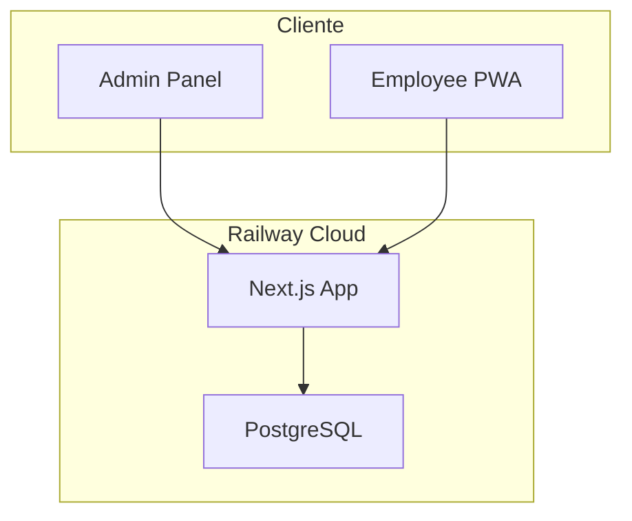
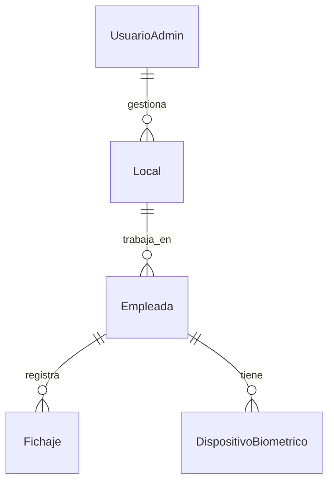
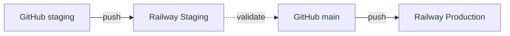

# RRHH2 - Arquitectura del Sistema

## Visión General

**RRHH2 (La Vene)** es una aplicación web de gestión de recursos humanos y fichajes para empleados, construida con Next.js 16 y desplegada en Railway.



---

## Stack Tecnológico

| Capa | Tecnología |
|------|------------|
| **Frontend** | Next.js 16 (App Router), React 19, TailwindCSS 4 |
| **Auth** | NextAuth.js (Admin), JWT Custom (Empleados) |
| **Base de Datos** | PostgreSQL (Railway) + Prisma ORM |
| **Despliegue** | Railway (staging + production) |
| **PWA** | next-pwa, Service Workers |

---

## Estructura de Carpetas

```
src/
├── app/                    # App Router (Next.js 16)
│   ├── (admin)/           # Rutas admin (Dashboard, Locales, Empleados, Fichajes, Reportes)
│   ├── (employee)/        # Rutas empleado (Fichar, Historial, Perfil)
│   ├── (public)/          # Login pages
│   └── api/               # API Routes
│       ├── auth/          # NextAuth + Employee auth
│       ├── empleadas/     # CRUD empleados
│       ├── fichajes/      # Registro de entrada/salida
│       ├── locales/       # CRUD locales
│       └── reportes/      # Generación de reportes
├── components/
│   ├── layout/            # AdminLayout, EmployeeLayout
│   ├── employee/          # FacialVerification, BiometricAuth
│   └── ui/                # Componentes Shadcn
├── lib/
│   ├── auth.ts            # NextAuth config + Employee JWT
│   ├── prisma.ts          # Cliente Prisma
│   ├── calculos.ts        # Cálculos de horas
│   └── url.ts             # URL helpers
├── hooks/                  # Custom hooks (useAdmin, useFichajes)
└── types/                  # TypeScript types
```

---

## Flujos de Autenticación

### Admin (NextAuth)

```
Login → NextAuth Credentials → JWT Session → Admin Pages
```

### Empleado (Custom JWT)

```
Login (PIN/Biométrico) → Custom JWT → Cookie → Employee PWA
```

---

## Base de Datos (Prisma)



**Modelos principales:**

- `UsuarioAdmin` - Administradores del sistema
- `Local` - Ubicaciones/tiendas
- `Empleada` - Empleados
- `Fichaje` - Registros de entrada/salida
- `DispositivoBiometrico` - WebAuthn credentials

---

## Variables de Entorno (Railway)

| Variable | Descripción |
|----------|-------------|
| `DATABASE_URL` | Conexión PostgreSQL |
| `NEXTAUTH_URL` | URL pública de la app |
| `NEXTAUTH_SECRET` | Secret para JWT de NextAuth |
| `JWT_SECRET` | Secret para JWT de empleados |

---

## Despliegue



**Importante:** Cada ambiente tiene su propia base de datos. El código se comparte, los datos NO.
